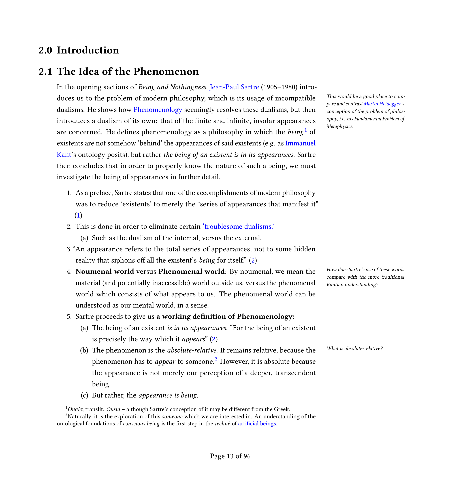

# Notes on Jean-Paul Sartre's Being and Nothingness

An comprehensive set of notes on Jean Paul Sartre's Being and Nothingness. Taken during the course of my study in preparation for my 2022 Senior Essay at St. John's College. These notes follow the organisation and progression of Sartre's monograph, and can be followed along in their reading.



## Accessing document
The notes are written in LaTeX, a document typesetting language. Compiled (ready-to-print) versions of these notes are available for both A4-paper, and U.S Letter size paper. 

* [**Sartre Notes Single Sided, U.S. Letter Size (Best for Scrolling)**](./sartre-notes-single-side-letter.pdf)
* [**Sartre Notes Double-Sided U.S. Letter Size (Best for Printing)**](./sartre-notes-double-side-letter.pdf)
* [**Sartre Notes Single Sided, A4 Size (Best for Scrolling)**](./sartre-notes-single-side-a4.pdf)
* [**Sartre Notes Double-Sided A4 Size (Best for Printing)**](./sartre-notes-double-side-a4.pdf)

The double-sided variants are best for printing. When printed and bound double-sided, the margin notes will always face the exterior of the binding. The single-sided variants are best for scrolling.

## Compiling document

In order to compile latex source files, run `make` in the terminal:

```
cd latex
make
make clean
```

Note: for any partial compiles where compilation fails at a certain point, you
should run `make clean` followed by make again. Trying to run make after a
failed compile would result in additional errors.

## Dependencies
This template uses a makefile to compile the latex source files. The makefile
uses `latexmk`, which runs latex the correct number of times. This is because
due to the presense of figures, tables, and biblatex databases, latex needs to
be called multiple times in some cases. Latexmk should be included in your
latex installation, but if it is now, you may download it here:

* http://personal.psu.edu/jcc8//software/latexmk-jcc/

Additionally, this template uses XeLaTeX by default, as it allows the inclusion
of unicode characters in the latex source files. If XeLaTeX is not installed, or
plain LaTeX is required, simply alter the `makefile` at the appropriate call:

```
# MAIN LATEXMK RULE
$(source_name).pdf: $(source_name).tex
  ...
	latexmk -pdf -xelatex -use-make $<
```

XeLaTeX allows one to use foreign characters like ü or æ natively in the latex
source files, though. So it's probably a good idea to install XeLaTeX:

* http://xetex.sourceforge.net/

### Related documentation
For an overview of how to populate biblatex `citations.bib` files, visit the
biblatex-mla manual at CTAN.

* https://www.ctan.org/pkg/biblatex-mla

### GPLv3 License
The raw template itself is licensed under the terms of the GPL (version 3). A
full copy of the license is attached in `LICENSE.md`. Naturally, any works
that you create using this template (i.e. any actual essays you write using
it) will be your own intellectual property. The GPLv3 license only applies to
any derivative templates.
